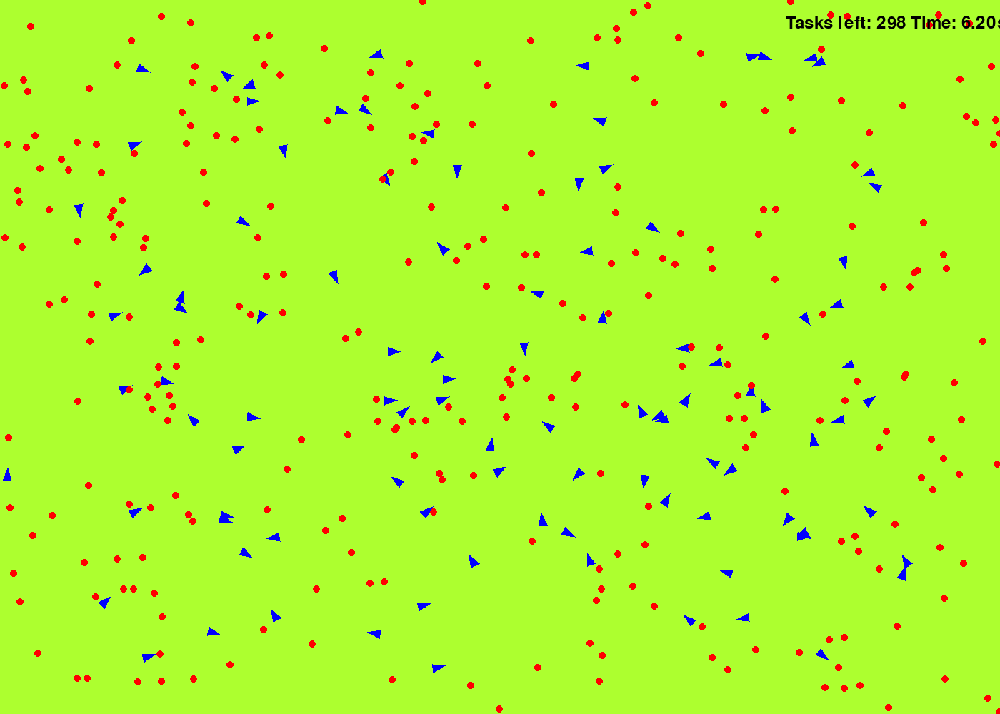

# SPADE (Swarm Planning And Decision Evaluation) Simulator

**SPADE** Simulator is a pygame-based application for simulating decentralized agent behavior using behavior trees. 
By integrating your custom decision-making algorithms as plugins, SPADE enables rigorous testing and comparative analysis against pre-existing algorithms. 


<div style="display: flex; flex-direction: row;">
    
    
</div>

- Example: (Left) `num_agents = 100`, `num_tasks = 300`; (Right) `num_agents = 1000`, `num_tasks = 3000`


## Features

- Simulates multiple agents performing tasks
- Agents use behavior trees for decision-making
- Real-time task assignment and execution
- Debug mode for visualizing agent behavior


## Installation

1. Clone the repository:
    ```sh
    git clone https://github.com/inmo-jang/spade-simulator.git
    cd spade-simulator
    ```

2. Install the required dependencies:
    ```sh
    pip install -r requirements.txt
    ```

3. Run the simulator:
    ```sh
    python main.py
    ```


## Configuration

Modify the `config.yaml` file to adjust simulation parameters:
- Number of agents and tasks
- Screen dimensions
- Agent behavior parameters

Refer to the configuration guide [CONFIG_GUIDE.md](/docs/CONFIG_GUIDE.md)


## Usage

### Controls
- `ESC` or `Q`: Quit the simulation
- `P`: Pause/unpause the simulation
- `R`: Start/stop recording the simulation as a GIF file

### Monte Carlo Analysis

1. Set `mc_runner.yaml` for your purpose and run the following:
    ```sh
    python mc_runner.py
    ``` 

2. Set `mc_comparison.yaml` and run the following:
    ```sh
    python mc_analyzer.py
    ``` 


## Code Structure
- `main.py`: Entry point of the simulation, initializes pygame and manages the main game loop.
- `/modules/`
    - `agent.py`: Defines the Agent class and manages agent behavior.
    - `task.py`: Defines the Task class and manages task behavior.
    - `behavior_tree.py`: Implements behavior tree nodes and execution logic.
    - `utils.py`: Utility functions and configuration loading.
- `/plugins/`
    - `my_decision_making_plugin.py`: Template for decision-making algorithms for each agent.


## Contributing
Feel free to fork the repository and submit pull requests. 
Refer to [TODO.md](/docs/TODO.md) for a list of pending tasks and upcoming features.


## License
[GNU GPLv3](LICENSE)
