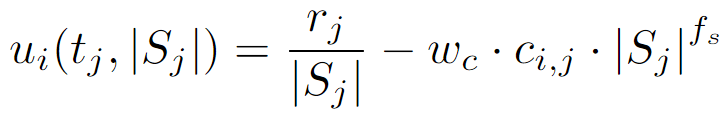

# GRAPE

This is the plugin for GRAPE, based on the following paper:

I. Jang, H. Shin, A. Tsourdos, "Anonymous Hedonic Game for Task Allocation in a Large-Scale Multiple Agent System", IEEE Transactions on Robotics, 34(6), 2018, pp. 1534-1548.

## How It Works

GRAPE is a decentralized algorithm using an anonymous hedonic game framework. Originally developed for ST-MR (Single Task - Multiple Robot) scenarios, GRAPE allows each agent to manage a single task while collaborating with multiple robots. The algorithm seeks to achieve a **Nash stable partition**, where no agent benefits from unilaterally changing its assigned tasks, thus indicating an agreed-upon task allocation among the swarm.

Based on the original paper, following enhancements were implemented:

- **Initial Partitioning Mechanism**: For a dynamic task generation scenario, each agent can construct an initial partition where tasks are assigned based on proximity to neighboring agents. This mechanism accelerates convergence to a Nash stable partition in dynamic environments. This mechanism can be also applied during initialization and post-task completion.

- **Social Inhibition Factor**: Although GRAPE was initially designed for ST-MR (Single Task - Multiple Robot) scenarios, it has been adapted for MT-SR (Multiple Task - Single Robot) scenarios by introducing the Social Inhibition factor. This addition penalizes collaboration among agents, encouraging task dispersion and better handling of scenarios where agents need to manage multiple tasks. 


## Parameters Example

```yaml
plugin: plugins.grape.grape.GRAPE
GRAPE:
  cost_weight_factor: 1.0
  social_inhibition_factor: 100
  initialize_partition: Distance # Options: None; Distance      
  reinitialize_partition_on_completion: Distance # Options: None; Distance; 
```

### Parameter Descriptions

- **`cost_weight_factor`**: 
  This factor is used in the calculation of an agent's individual utility. The utility is calculated as follows:

  <div>
    
  </div>
  

  where `cost_weight_factor` influences the weighting factor `w_c` for the cost component of the utility function.


- **`social_inhibition_factor`**: 
  This factor is used in the utility calculation to penalize collaboration. In the above equation, `social_inhibition_factor` increases `f_s`, which is the penalty for having more collaborators. 
  This parameter is essential for MT-SR scenarios. However, even with a high value, agents may still collaborate if there are only a few tasks in the vicinity.  

- **`initialize_partition`**: 
  Determines the method for initializing the partition.
  - **`None`**: Starts with an empty partition.
  - **`Distance`**: Each agent creates an initial partition where tasks are assigned based on proximity, with each agent initially taking the task closest to its neighbors.

- **`reinitialize_partition_on_completion`**: 
  Defines how the partition is handled upon completion.
  - **`None`**: No reinitialization is performed.
  - **`Distance`**: Reinitializes the partition using the same distance-based mechanism as `initialize_partition`, reallocating tasks based on proximity.


## Sample Result

<div style="display: flex; flex-direction: row;">
    
</div>

### `config.yaml` used

This was executed with the following configuration:
```yaml
decision_making: 
  plugin: plugins.grape.grape.GRAPE
  GRAPE:
    cost_weight_factor: 1.0
    social_inhibition_factor: 100
    initialize_partition: Distance 
    reinitialize_partition_on_completion: Distance 

agents:
  behavior_tree_xml: default_bt.xml 
  quantity: 10
  locations:
    x_min: 0
    x_max: 1400
    y_min: 0
    y_max: 1000
    non_overlap_radius: 0 
  max_speed: 0.25  
  max_accel: 0.05
  max_angular_speed: 0.25
  target_approaching_radius: 50
  work_rate: 1  
  communication_radius: 500 
  situation_awareness_radius: 500 
  random_exploration_duration: 1000.0 

tasks:
  quantity: 100
  locations:
    x_min: 0
    x_max: 1400
    y_min: 0
    y_max: 1000
    non_overlap_radius: 0
  threshold_done_by_arrival: 10.0
  amounts:  
    min: 6.0
    max: 60.0      
  dynamic_task_generation:
    enabled: True
    interval_seconds: 2000
    max_generations: 3
    tasks_per_generation: 25

simulation:
  sampling_freq: 1.0 
  speed_up_factor: 0 
  max_simulation_time: 0
  agent_track_size: 400  
  screen_width: 1400 
  screen_height: 1000 
  gif_recording_fps: 0.05  
  task_visualisation_factor: 3 
  profiling_mode: False
  rendering_mode: Screen  
  rendering_options: 
    agent_tail: True
    agent_communication_topology: True
    agent_situation_awareness_circle: False
    agent_id: True
    agent_work_done: True
    agent_assigned_task_id: True
    agent_path_to_assigned_tasks: True
    task_id: False
  saving_options:
    output_folder: output
    with_date_subfolder: True
    save_gif: False
    save_timewise_result_csv: True    
    save_agentwise_result_csv: True
    save_config_yaml: True
```