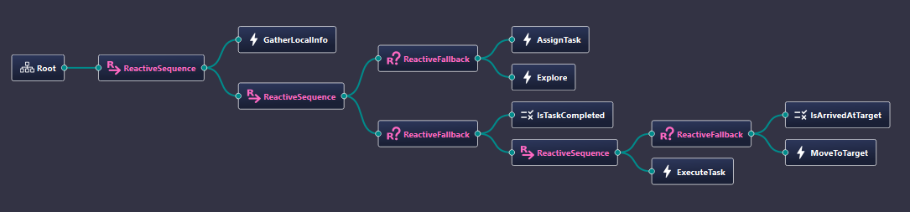
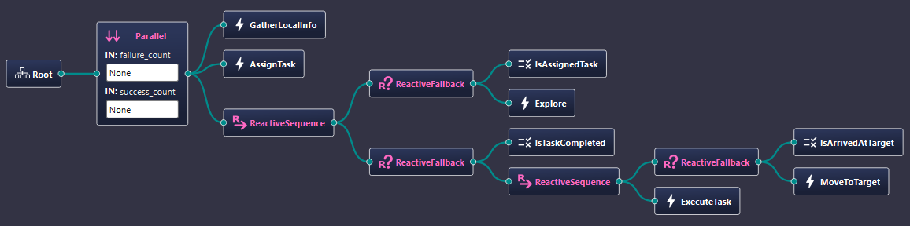

## Parallel Scenario (`scenarios.features.parallel`)

The `scenarios.features.parallel` scenario is functionally identical to the `simple` scenario in terms of agent behaviour and environment setup.  
The key difference lies in the structure of the Behaviour Tree (BT) used for agent control.

- **`simple` scenario:** Implements the BT structure shown in **Fig. 1**, where action nodes are arranged using standard control nodes such as `Sequence` and `Fallback`.
- **`parallel` scenario:** Implements the BT structure shown in **Fig. 2**, replacing parts of the control flow with the `Parallel` node to allow multiple child branches to be ticked sequentially within the same tick and evaluated according to `success_count` / `failure_count` thresholds.

<div align="center">
  
**Fig. 1** — BT structure for the `simple` scenario  


**Fig. 2** — BT structure for the `parallel` scenario  


</div>


### How to Run

```bash
# Run the simple scenario
python main.py --config=config/default/simple.yaml

# Run the parallel scenario
python main.py --config=config/features/parallel.yaml