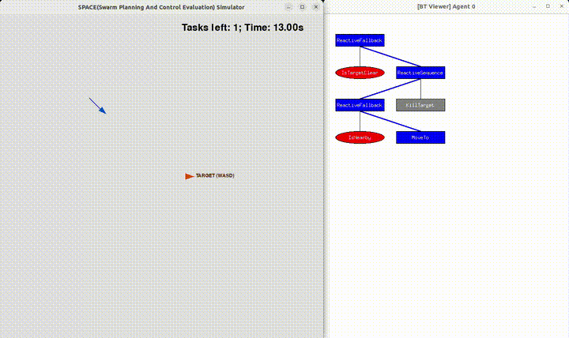

# Turtle Catcher

A minimal scenario demonstrating how to use the Behaviour Tree runtime in the SPACE Simulator, designed as a **direct counterpart to `py_bt_ros/scenarios/example_turtlesim`**.

The same BT logic can be tested here first, then ported to `py_bt_ros` for ROS-based robots with minimal changes.

## Scenario

- **Catcher** (blue triangle) — controlled by a Behaviour Tree; autonomously chases the target.
- **Target** (orange triangle) — controlled by the keyboard; try to run away from the catcher.

The catcher catches the target when it gets close enough (`IsNearby` succeeds), then removes it (`KillTarget`).

## How to Run

From the `space-simulator` root directory:

```bash
python3 main.py --config=scenarios/features/turtle_catcher/config.yaml
```

## Keyboard Control

Once the window opens, use the keyboard to move the target and try to escape:

| Key | Action |
|-----|--------|
| `W` / `↑` | Move up |
| `S` / `↓` | Move down |
| `A` / `←` | Move left |
| `D` / `→` | Move right |
| `P` | Pause / Resume |
| `R` | Reset scenario |
| `Q` / `Esc` | Quit |

## Relation to py_bt_ros

| | space-simulator | py_bt_ros |
|---|---|---|
| BT structure | `default_bt.xml` | identical |
| Node names | `IsNearby`, `MoveTo`, `KillTarget`, `IsTargetClear` | identical |
| Target control | Keyboard (this window) | `ros2 run turtlesim turtle_teleop_key` |
| Catcher movement | `agent.follow()` (pygame physics) | `NavigateToPose` ROS action |

Only `bt_nodes.py` needs to be rewritten when porting — the XML and BT logic stay the same.

## Demo


